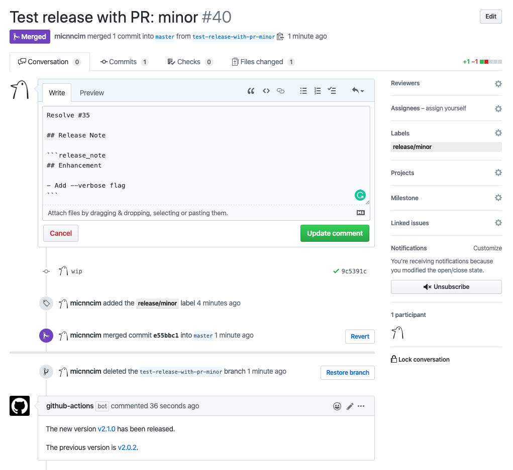
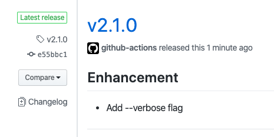

# Action Bump Semver

[![actions-workflow-test][actions-workflow-test-badge]][actions-workflow-test]
[![release][release-badge]][release]
[![license][license-badge]][license]

This is a GitHub Action to bump the given semver version up.

For example:

- `current_version=v1.2.3`, `level=major` -> `new_version=v2.0.0`
- `current_version=1.2.3`, `level=major` -> `new_version=2.0.0`
- `current_version=v1.2.3`, `level=minor` -> `new_version=v1.3.0`

It would be more useful to use this with other GitHub Actions' outputs.

## Inputs

|       NAME        |                                       DESCRIPTION                                        |   TYPE   | REQUIRED | DEFAULT |
|-------------------|------------------------------------------------------------------------------------------|----------|----------|---------|
| `current_version` | The current version.                                                                     | `string` | `true`   | `N/A`   |
| `level`           | A semver update level `{major, premajor, minor, preminor, patch, prepatch, prerelease}`. | `string` | `false`  | `minor` |

## Outputs

|     NAME      |        DESCRIPTION         |   TYPE   |
|---------------|----------------------------|----------|
| `new_version` | The bumped semver version. | `string` |

## Example

### Simple

```yaml
name: Push a new tag with minor update

on:
  push:
    branches:
      - master

jobs:
  release:
    runs-on: ubuntu-latest
    steps:
      - uses: actions/checkout@v2

      - uses: actions-ecosystem/action-get-latest-tag@v1
        id: get-latest-tag

      - uses: actions-ecosystem/action-bump-semver@v1
        id: bump-semver
        with:
          current_version: ${{ steps.get-latest-tag.outputs.tag }}
          level: minor

      - uses: actions-ecosystem/action-push-tag@v1
        with:
          tag: ${{ steps.bump-semver.outputs.new_version }}
          message: '${{ steps.bump-semver.outputs.new_version }}: PR #${{ github.event.pull_request.number }} ${{ github.event.pull_request.title }}'
```

### More Practical

A practical example is below. If you're interested in the latest one, see [.github/workflows/release.yml](.github/workflows/release.yml).




With this workflow, you can automatically update a Git tag and create a GitHub release with only adding a *release label* and optionally a *release note* after a pull request has been merged.

1. [actions-ecosystem/action-release-label](https://github.com/actions-ecosystem/action-release-label) gets a semver update level from a *release label*.
2. [actions-ecosystem/action-get-latest-tag](https://github.com/actions-ecosystem/action-get-latest-tag) fetches the latest Git tag in the repository.
3. [actions-ecosystem/action-bump-semver](https://github.com/actions-ecosystem/action-bump-semver) bumps up the Git tag previously fetched based on the semver update level at the step *1*.
4. [actions-ecosystem/action-regex-match](https://github.com/actions-ecosystem/action-regex-match) extracts a *release note* from the pull request body.
5. [actions-ecosystem/action-push-tag](https://github.com/actions-ecosystem/action-push-tag) pushes the bumped Git tag with the pull request reference as a message.
6. [actions/create-release](https://github.com/actions/create-release) creates a GitHub release with the Git tag and the *release note* when the semver update level is *major* or *minor*.
7. *[Optional]* [actions-ecosystem/action-create-comment](https://github.com/actions-ecosystem/action-create-comment) creates a comment that reports the new GitHub release.

For further details, see each action document.

```yaml
name: Create Release

on:
  pull_request:
    types: [closed]

jobs:
  release:
    runs-on: ubuntu-latest
    steps:
      - uses: actions/checkout@v2

      - uses: actions-ecosystem/action-release-label@v1
        id: release-label
        if: ${{ github.event.pull_request.merged == true }}

      - uses: actions-ecosystem/action-get-latest-tag@v1
        id: get-latest-tag
        if: ${{ steps.release-label.outputs.level != null }}

      - uses: actions-ecosystem/action-bump-semver@v1
        id: bump-semver
        if: ${{ steps.release-label.outputs.level != null }}
        with:
          current_version: ${{ steps.get-latest-tag.outputs.tag }}
          level: ${{ steps.release-label.outputs.level }}

      - uses: actions-ecosystem/action-regex-match@v2
        id: regex-match
        if: ${{ steps.release-label.outputs.level != null }}
        with:
          text: ${{ github.event.pull_request.body }}
          regex: '```release_note([\s\S]*)```'

      - uses: actions-ecosystem/action-push-tag@v1
        if: ${{ steps.release-label.outputs.level != null }}
        with:
          tag: ${{ steps.bump-semver.outputs.new_version }}
          message: "${{ steps.bump-semver.outputs.new_version }}: PR #${{ github.event.pull_request.number }} ${{ github.event.pull_request.title }}"

      - uses: actions/create-release@v1
        if: ${{ steps.release-label.outputs.level == 'major' || steps.release-label.outputs.level == 'minor' }}
        env:
          GITHUB_TOKEN: ${{ secrets.GITHUB_TOKEN }}
        with:
          tag_name: ${{ steps.bump-semver.outputs.new_version }}
          release_name: ${{ steps.bump-semver.outputs.new_version }}
          body: ${{ steps.regex-match.outputs.group1 }}

      - uses: actions-ecosystem/action-create-comment@v1
        if: ${{ steps.bump-semver.outputs.new_version != null }}
        with:
          github_token: ${{ secrets.GITHUB_TOKEN }}
          body: |
            The new version [${{ steps.bump-semver.outputs.new_version }}](https://github.com/${{ github.repository }}/releases/tag/${{ steps.bump-semver.outputs.new_version }}) has been released.
```

## License

Copyright 2020 The Actions Ecosystem Authors.

Action Bump Semver is released under the [Apache License 2.0](./LICENSE).

<!-- badge links -->

[actions-workflow-test]: https://github.com/actions-ecosystem/action-bump-semver/actions?query=workflow%3ATest
[actions-workflow-test-badge]: https://img.shields.io/github/workflow/status/actions-ecosystem/action-bump-semver/Test?label=Test&style=for-the-badge&logo=github

[release]: https://github.com/actions-ecosystem/action-bump-semver/releases
[release-badge]: https://img.shields.io/github/v/release/actions-ecosystem/action-bump-semver?style=for-the-badge&logo=github

[license]: LICENSE
[license-badge]: https://img.shields.io/github/license/actions-ecosystem/action-bump-semver?style=for-the-badge
